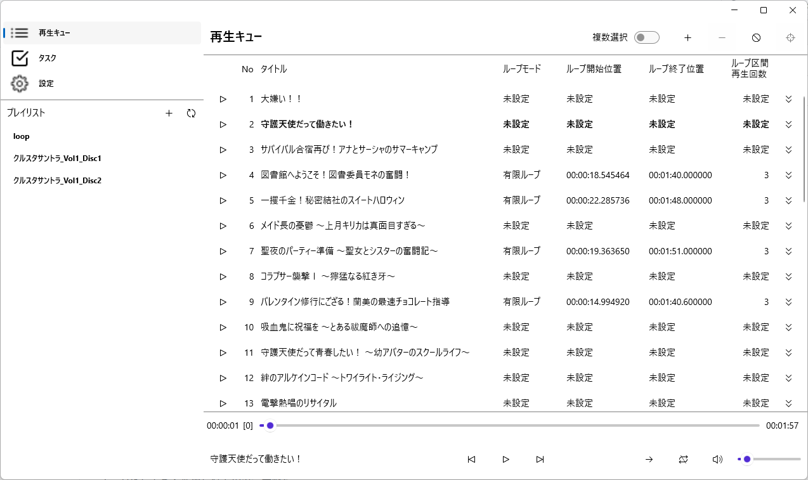

# SoundTrackPlayer(仮称)

## 概要
ゲームなどでよく使用されている、無限ループ可能な楽曲に特化した楽曲プレイヤーです。

## スクリーンショット

## 特徴

1. 設定したループ区間を繰り返し再生できます。

	- トラックを再生時、ループ区間を指定した回数分再生します。ループ区間終了位置から開始位置に一瞬でジャンプするため、自然にループします。
	- ループ区間やループ回数の設定は、トラック設定という形で楽曲ファイルのサイドカーファイルとして保存します。
		- 例: 楽曲ファイルが "track01.flac" の場合、サイドカーファイルが "track01.flac.toml" として保存されます。

2. プレイリストに対応しています(m3u のみ)。

	- プレイリストに登録された楽曲を連続して再生できます。

3. ループ区間の設定を補助する機能があります。

	- ループ区間の終了位置が指定されていれば、ループ区間開始位置の検出を試みることが可能です。
	- 非常に単純なアルゴリズムで実装しているため、CPU が非力だと時間がかかります。 また、誤った位置が検出されてしまうことがあります。あくまで補助としてご使用ください。
		- ループ区間の検出を専門とするアプリケーションがあるようです(例:  [AutoLooper](https://github.com/YoshimiKudo/AutoLooper))。

## 対応 OS
- Windows 11

## 対応している楽曲ファイルの形式
本アプリケーションが使用しているライブラリ(SoundFlow)の対応形式に準じます。

- mp3
- flac
- wav (PCM)

## 対応しているプレイリストの形式

- *.m3u8 (UTF-8 でエンコードされた m3u ファイル)

## 制限事項

1. [Extended M3U](https://ja.wikipedia.org/wiki/M3U#Extended_M3U)には非対応です。Extended M3Uで記述されたプレイリストを本アプリケーションから編集すると、Extended M3Uで記載された情報は消失します。

2. ヘッドホンを接続・切断したときなどの音声出力デバイスの切り替えが上手くいかず、再生が停止することがあります。
	その場合は出力したいデバイスがデフォルトのデバイスとなっていることを確認して、本アプリケーションを再起動してください。

## 使用にあたって

本アプリケーションには MIT ライセンスを適用します。

本アプリケーションは無保証であり、作者は本アプリケーション使用によって生じる損害等に対して一切責任を負いません。

手元で致命的な不具合が容易に発生しないことは確認していますが、不具合によって楽曲ファイルなどが破損したり、消失したりする可能性が無いとは言い切れません。
本アプリケーションに限った話ではありませんが、ファイルは定期的にバックアップを取得することをお勧めします。

本アプリケーションで使用しているライブラリ等のライセンスについては、[こちら](SoundTrackPlayer/Resources/Raw/3rd-party.html)を参照してください。

## 使い方

ここでは基本的な使い方を示します。
個々の GUI 要素については以下のページを参照してください。
- [GUI 画面説明 (Windows)](documents/gui-windows.md)

### 事前準備

以下はビルド済みバイナリを Windows で動作させる場合の手順です。

1. ビルド済みのバイナリを[こちら](https://github.com/ptr-tsukuyomi/SoundTrackPlayer/releases)からダウンロードします。
	特に理由がない限り、最新のバージョンを選択してください。

2. ダウンロード後 zip ファイルを展開し、SoundTrackPlayer.exe が存在することを確認します。

3. お好みのフォルダに展開したファイルを格納します。

	※ ファイルはすべて同じフォルダに配置してください。ファイルが欠けていると正常に動作しません。

2. [.NET 10.0 ランタイム](https://dotnet.microsoft.com/ja-jp/download)をインストールしてください。
	ランタイムの選択を求められたら「.NET デスクトップ ランタイム」を選択します。

### 1 曲だけ再生する
1. SoundTrackPlayer.exe を実行します。
2. 画面左側に表示されているメニューから「再生キュー」をクリックします。
3. 画面上部右側の + アイコンのボタンをクリックし、表示されたダイアログで再生したい楽曲ファイルを開きます。
4. 楽曲ファイルがトラックとして再生キューに登録されるので、左側に表示されている再生ボタンをクリックします。

### ループ区間を指定してループ再生する
1. ループ再生したいトラックを再生し、一時停止します。
2. 画面下部の再生位置と残りループ回数が表示されている領域 (00:00:00 [0] のように表示されている部分) をクリックして、「プレイヤーステータス」を表示します。
3. プレイヤーステータスの中で以下を設定します。
	- ループモードを選択します。
	- ループ区間を hh:mm:ss.xxxxxx 形式で入力します。(hh: 時間, mm: 分, ss: 秒, xxxxxx: マイクロ秒)
	- ループモードで「有限ループ」を選択した場合は、残りループ回数(ループ終了位置に達したときにループ開始位置に戻る回数)を入力します。
4. 画面下部の再生ボタンをクリックすると、設定した通りにループ再生されます。

注1: 入力済みの内容は、入力欄からフォーカスを外した際に反映されます。

注2: この手順ではループ位置を入力するために一時停止しましたが、再生中にループ区間などを入力しても反映されます。

注3: プレイヤーステータスに入力した値は、トラックの再生が終わると消えてしまいます。トラックの再生が終わっても消えないようにするには、以下の「トラック設定を行う」を実施してください。

注4: 画面下部の現在位置が表示されている領域の [n] (n: 整数) は、残りループ回数を表示しています。

### トラック設定を行う
1. ループ再生したいトラックの右側にある下向きの矢印のボタンをクリックし、トラック設定編集画面を表示します。
2. トラック設定編集画面の中で以下を設定します。
	- ループモードを選択します。
	- ループ区間を hh:mm:ss.xxxxxx 形式で入力します。(hh: 時間, mm: 分, ss: 秒, xxxxxx: マイクロ秒)
	- ループモードで「有限ループ」を選択した場合は、ループ区間再生回数を入力します。

再生中のトラックがトラック設定を実施したトラックに変わると、トラック設定の値がプレイヤーステータスに自動的に反映されます。
トラック設定をファイルに保存して永続化したい場合は、トラック設定編集画面の右側にある保存ボタン(フロッピーディスクのアイコン)をクリックしてください。

保存ボタンをクリックすると、トラック設定が含まれたファイル(サイドカーファイル)が楽曲ファイルが格納されているフォルダに保存されます。
ファイル名は「楽曲ファイル名」.toml です。

楽曲ファイルをトラックとして登録したとき、本アプリケーションはサイドカーファイルが存在しているか確認し、存在していれば、その内容をトラック設定として読み込みます。

### プレイリストを再生する
1. 画面左側に表示されているメニューから「設定」をクリックします。
2. 「コンテンツディレクトリ」で、[参照] をクリックしてフォルダ選択ダイアログを表示します。
3. プレイリストが含まれているフォルダを選択し [フォルダーの選択] をクリックします。
4. 選択したフォルダのパスが入力欄に記載されていることを確認し、[登録] をクリックします。
5. 画面左側メニューに表示されている「プレイリスト」横の更新ボタン(矢印で円を描いているアイコン)をクリックします。
6. 「プレイリスト」の下部に、プレイリストの探索で検出されたプレイリストが表示されるので、再生したいプレイリストをクリックします。
7. プレイリストのトラックが表示されるので、再生したいトラックの左端にある再生ボタンをクリックします。

注1: プレイリストの探索は登録したフォルダだけでなく、その子や孫にあたるフォルダでも実施します。

### ループ区間の開始位置を検出する

1. 「トラック設定を行う」にて、ループ区間の終了位置を指定します。
2. ループ区間の開始位置にある検出ボタン(ターゲットに狙いを定めているアイコン)をクリックします。
3. ループ区間の開始位置の検出が開始され、完了するとループ区間の開始位置が自動的に設定されます。
4. トラックを再生し、ループ区間の設定が合っているか、違和感がないか確認します。
5. 問題がなければ、トラック設定右端にある保存ボタンでトラック設定をファイルに保存します。

注1: ループ区間の開始位置の検出ではトラック設定は自動的に更新しますが、プレイヤーステータスには自動で反映されません。

注2: 検出の進捗状況は、画面左側「タスク」をクリックして表示されるタスク一覧画面で確認できます。

### その他
- 再生キューではトラックをドラッグ&ドロップすることによって再生順を入れ替えることが可能です。ただし、複数選択モードでは入れ替え不可です。
- タスクをクリックすると、タスクから出力されたメッセージが表示されます。状態が完了(チェックアイコン)にならない場合は確認してみてください。
- サイドカーファイルは Toml 形式で記述されています。手動で書き換えても問題ありません。
