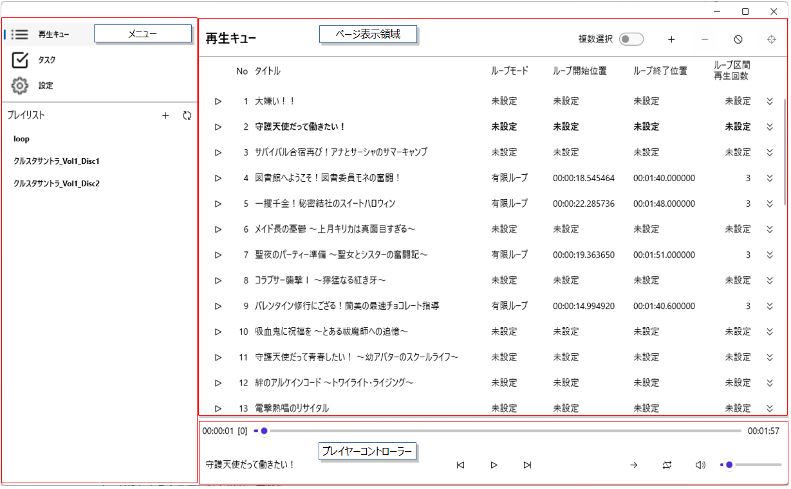
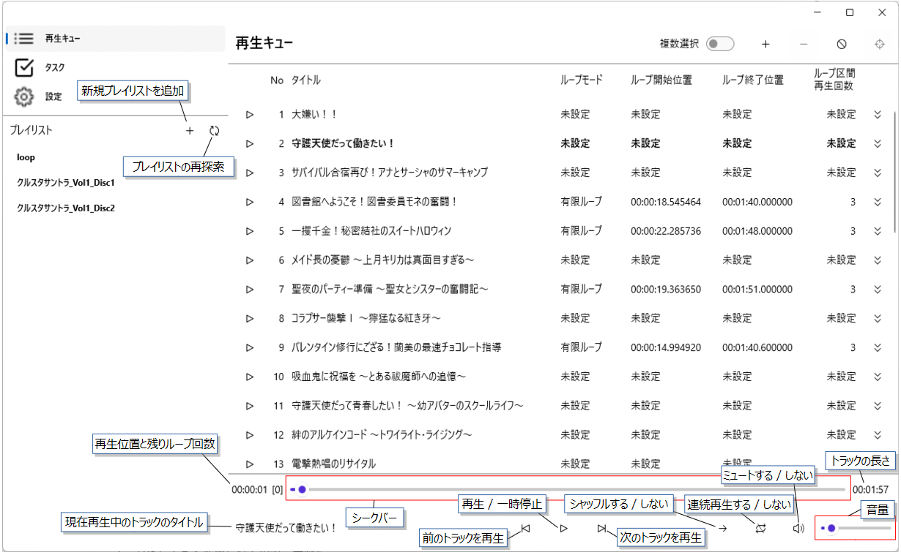
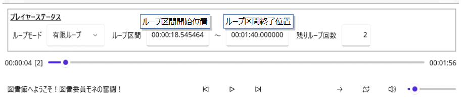
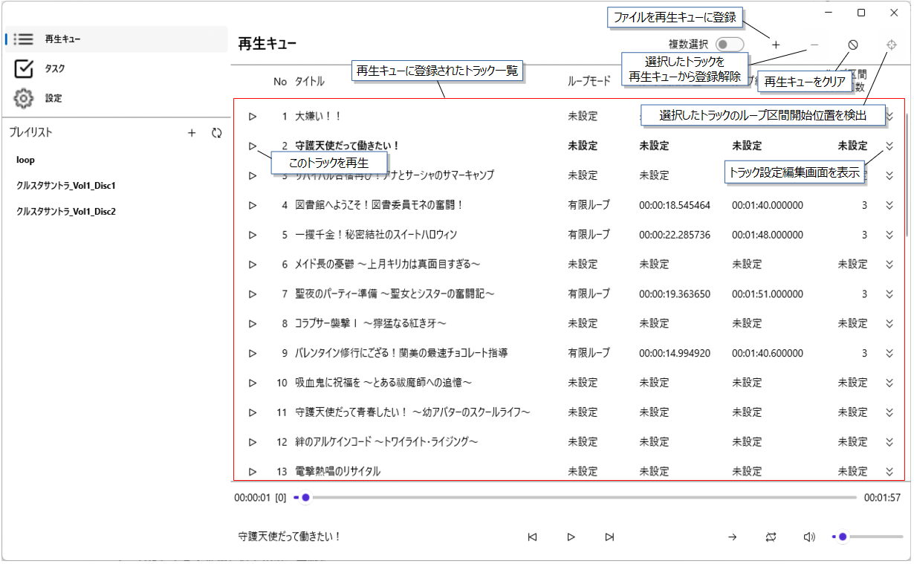
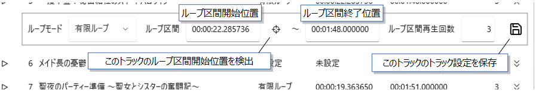
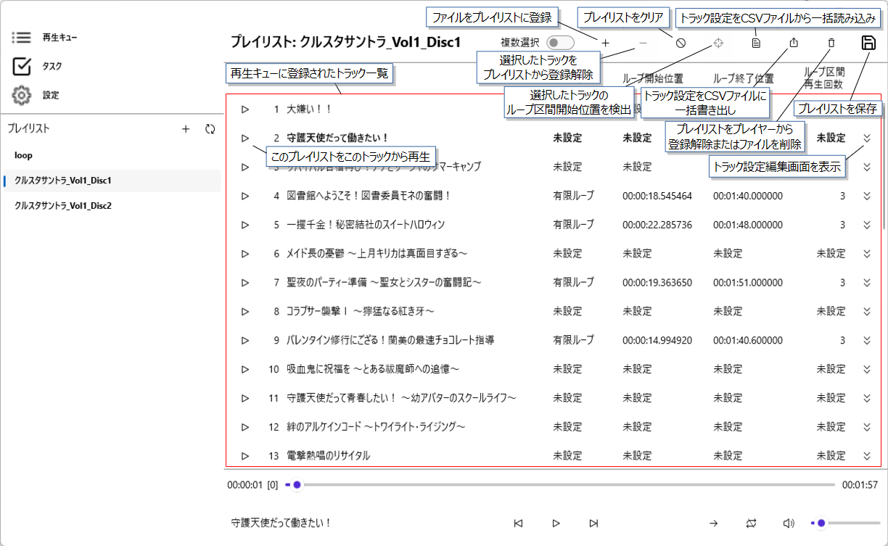
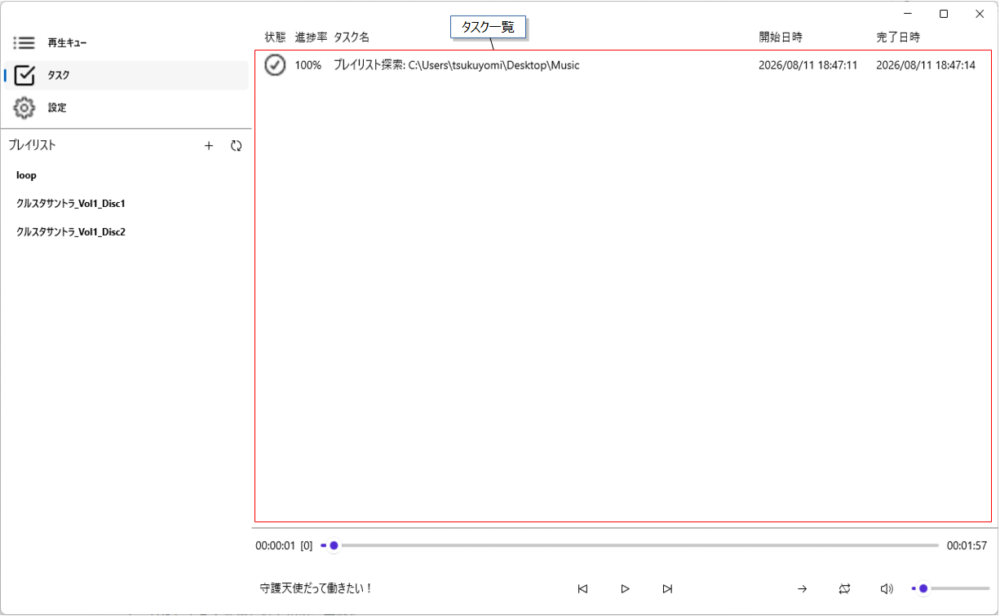
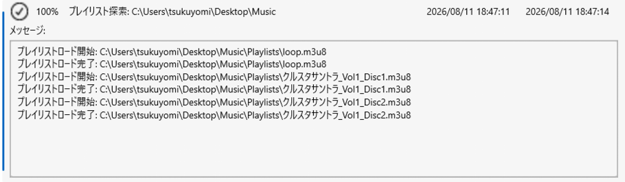
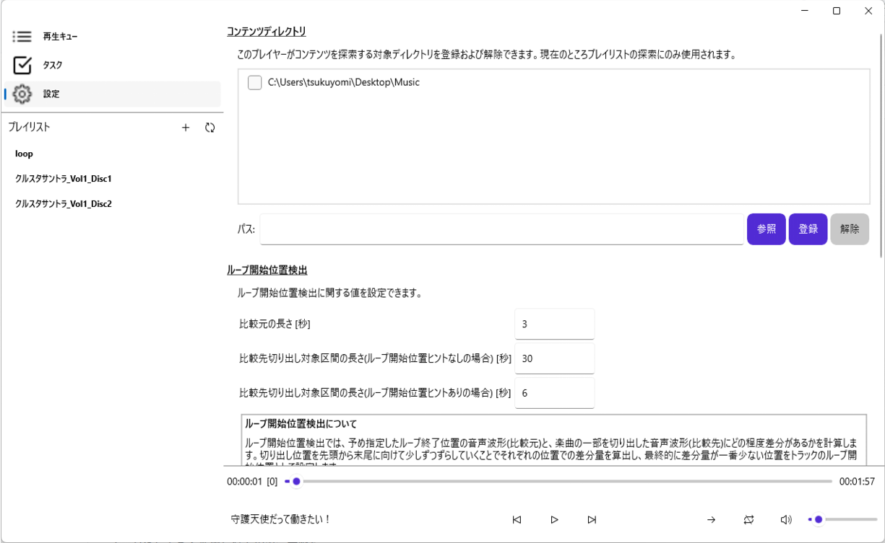

# GUI 画面説明 (Windows)

GUI の画面説明を以下に示します。
各画像に簡単な説明を記載し、文章で補足説明を記載しています。

なお、画面の画像および説明は v1.4.0 時点のものです。

## メインウインドウの表示領域



### メニュー
右側の「ページ表示領域」に表示する内容を選択できます。
個々のページの説明については後述します。

### ページ表示領域
「メニュー」で選択したページを表示する領域です。

### プレイヤーコントローラー
プレイヤー状態を確認したり、プレイヤーの操作を行ったりできます。


## メニューとプレイヤーコントローラー


### 再生位置と残りループ回数
以下の形式で表示します。
```
hh:mm:ss.xxxxxx [n]

ただし、
- hh: 時間
- mm: 分
- ss: 秒
- xxxxxx: マイクロ秒
- n: 残りループ回数
```

また、この領域(またはトラックの長さ)をクリックすると、以下のプレイヤーステータス画面が開きます。開いた状態で再度クリックすると閉じます。



### 連続再生する / しない
再生キューの末尾トラックの再生が終わったときに、再生キューの先頭に戻って再生を継続できます。

### シャッフルする / しない
以下のタイミングで再生キューをシャッフルすることができます。
- プレイリストからトラックを再生開始したとき
- 再生キュー末尾のトラックの再生が終わったとき

## 再生キュー


### 選択したトラックのループ区間開始位置を検出
ループ区間開始位置の検出を選択したトラックすべてに対して実施します。
具体的な内容は[トラック設定編集画面の説明](#このトラックのループ区間開始位置を検出)を参照してください。

### トラック設定編集画面を表示
以下のようなトラック設定編集画面を表示します。



#### このトラックのループ区間開始位置を検出

ループ区間開始位置の検出を行います。
ループ区間終了位置周辺の波形を基準とするため、事前にループ区間終了位置を入力してください。


## プレイリスト



本アプリケーションは起動時に、[設定](#設定)で指定したフォルダに含まれるプレイリストを探索します。
検出したプレイリストは、画面左側の「プレイリスト」下部に表示されます。

個々のプレイリストをクリックすると、右側にプレイリストのトラックが表示されます。

### このプレイリストをこのトラックから再生
再生キューを空にして、このプレイリストのトラックすべてを再生キューに追加し、このトラックから再生します。

### トラック設定をCSVファイルに一括書き出し
以下の形式でCSVファイルに書き出します。トラックの順番は、画面に表示されている順番です。
```
トラックタイトル1,ループ区間開始位置1,ループ区間終了位置1,ループモード1,ループ区間再生回数1
トラックタイトル2,ループ区間開始位置2,ループ区間終了位置2,ループモード2,ループ区間再生回数2
トラックタイトル3,ループ区間開始位置3,ループ区間終了位置3,ループモード3,ループ区間再生回数3
...
```

### トラック設定をCSVファイルから一括読み込み
[トラック設定をCSVファイルに一括書き出し](#トラック設定をCSVファイルに一括書き出し)で書き出したCSVファイルを読み込み、トラック設定を一括で更新します。
事前に画面に表示されているトラックの順番をCSVファイルの記載順に合わせてください(CSVファイルのトラックタイトルは使用しません)。

### プレイリストをプレイヤーから登録解除またはファイルを削除
クリックするとダイアログが表示され、プレイヤーから登録を解除するか、ファイルも削除するか選択できます。

### プレイリストを保存
プレイリストファイルを保存します。

本アプリケーションで新規作成したプレイリストの場合で保存先がまだ決まっていない場合は、保存先を指定するダイアログが表示されます。

また、プレイリストに登録されたすべてのトラックを対象に、トラック設定の保存が行われます。

### トラック設定編集画面を表示
[トラック設定編集画面の説明](#トラック設定編集画面を表示)を参照してください。

## タスク



各タスクをクリックすると、以下のようにタスクから出力されたメッセージを表示できます。



## 設定



プレイリストの参照先などを指定します。個々の項目の説明は画面内に記載しています。
